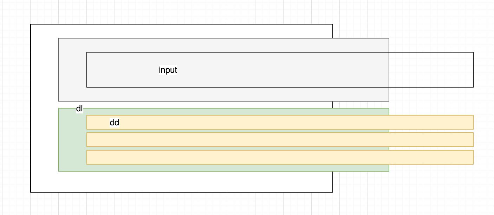
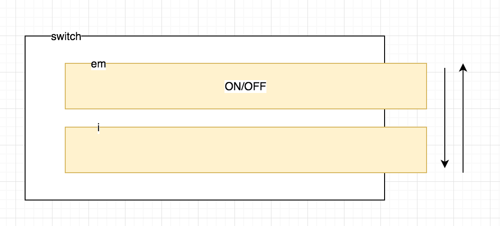

## 输入框
**思路**
- 使用div包裹input框，设置div的宽度，input的宽度为100%

## 下拉选择
**dom结构**


**思路**
- 选择项使用`dl`,`dd`标签,class是`zui-anim-upbit`
- 通过添加/移除class来控制隐藏/显示
- 给列表添加动画
```css
.zui-anim-upbit{
			animation:mymove .5s infinite;
			animation-iteration-count:1;
		}

@keyframes mymove
{
  0%{
    transform: translate3d(0,30px,0);
      opacity: .3;
  }

  100%{
    transform: translate3d(0,0,0);
      opacity: 1;
  }
}
```

**知识点**
- tap-highlight-color（移动端）
> 设置或检索对象的轻按时高亮。当用户轻按一个链接或者JavaScript可点击元素时给元素覆盖一个高亮色，如果想取消这个高亮，将值设置为全透明即可，比如transparent
- @keyframes
> 用来创建动画，创建动画的原理是，将一套 CSS 样式逐渐变化为另一套样式。
- animation
> animation-iteration-count 规定动画的播放次数
- cursor:not-allowed!important 
> 禁止的手势

## 复选框
**思路**
- 使用`i`标签作为checkbox框
- 给`i`标签设置固定的内容，通过点击添加类，包括background-color和border-color
- 动效通过给`i`标签设置`transition: .2s linear;`实现
- (复杂)添加伪类实现`i`标签的内部内容

## 开关
**dom结构**


**思路**
- `i`标签作圆形容器
- `em`做为文字NO/OFF的容器
- 每次点击的时候，通过移除/添加class，改变展示效果，每次点击修改class，左右移动`em`和`i`
