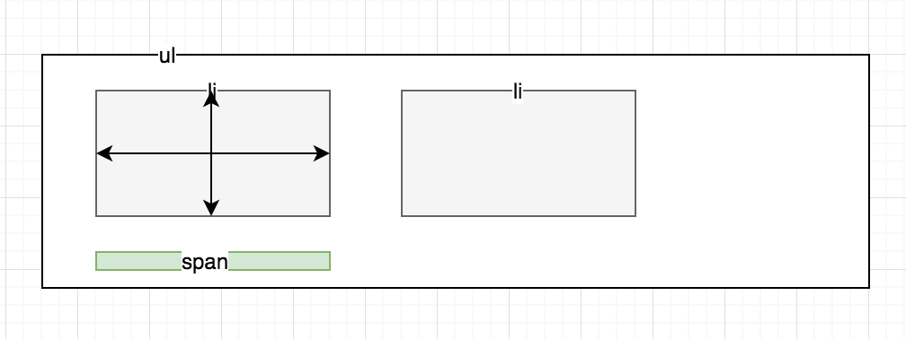

## 弹出框
**dom结构**

**思路**
- 下标绿色显示条放在`ul`里面，进行绝对定位，通过控制绿色条的left,top来处理
- 绿色条的宽通过鼠标进入事件触发获取每个`item`的宽度，使用`el.offsetWidth`获取目标元素的宽度
- 绿色条的left(属性规定元素的左边缘。该属性定义了定位元素左外边距边界与其包含块左边界之间的偏移)也是通过进入出发获取目标元素`el.offsetLeft`的距离得到
- 这样，绿色条的宽度与目标元素保持一致，left也与目标元素保持一致

**箭头**
- 箭头的上下滚动效果通过class描绘出箭头样式
- 通过`transition: all .2s`处理动画
- 箭头的上下移动效果，通过设置`top`处理