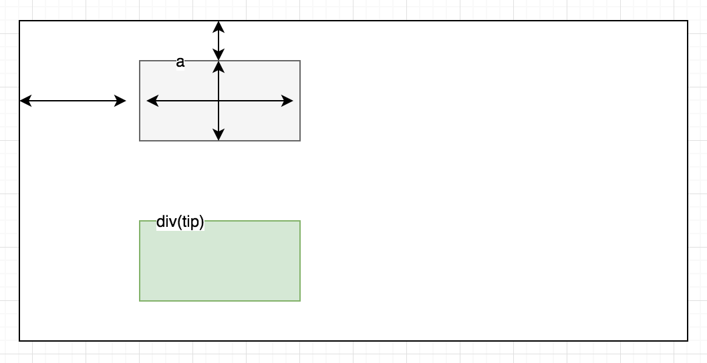

## 进度条
**dom结构**

**思路**
- 主要是计算tip相对于目标元素的位置
- tip是全局的独立dom
- 鼠标移入获取目标元素的`getBoundingClientRect`，这个用来获取目标元素在页面中(可视区域)的位置
- 针对上下左右不同位置的tip在`getBoundingClientRect`基础上计算tip的位置
- 三角符号用css实现

> 为了兼容性使用a标签描述button